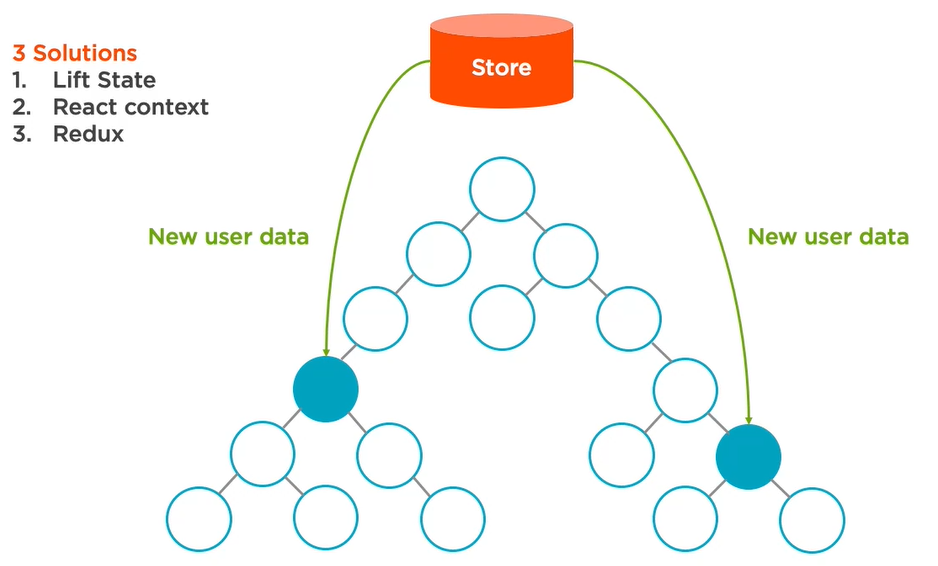

# Starter Kit for [Building Applications in React and Redux](http://www.pluralsight.com/author/cory-house) on Pluralsight

## Get Started

1. **Install [Node 8](https://nodejs.org)** or newer. Need to run multiple versions of Node? Use [nvm](https://github.com/creationix/nvm) or [nvm-windows](https://github.com/coreybutler/nvm-windows)(https://github.com/coryhouse/pluralsight-redux-starter/archive/master.zip)
2. **Navigate to this project's root directory on the command line.**
3. **Install Node Packages.** - `npm install`
4. **Install [React developer tools](https://chrome.google.com/webstore/detail/react-developer-tools/fmkadmapgofadopljbjfkapdkoienihi?hl=en) and [Redux Dev Tools](https://chrome.google.com/webstore/detail/redux-devtools/lmhkpmbekcpmknklioeibfkpmmfibljd?hl=en)** in Chrome.
5. Having issues? See below.

## Having Issues? Try these things first:

1. Run `npm install` - If you forget to do this, you'll get an error when you try to start the app later.
2. Don't run the project from a symbolic link. It will cause issues with file watches.
3. Delete any .eslintrc in your user directory and disable any ESLint plugin / custom rules within your editor since these will conflict with the ESLint rules defined in the course.
4. On Windows? Open your console as an administrator. This will assure the console has the necessary rights to perform installs.
5. Ensure you do not have NODE_ENV=production in your env variables as it will not install the devDependencies. To check run this on the command line: `set NODE_ENV`. If it comes back as production, you need to clear this env variable.
6. Nothing above work? Delete your node_modules folder and re-run npm install.

### Production Dependencies

| **Dependency**   | **Use**                                              |
| ---------------- | ---------------------------------------------------- |
| bootstrap        | CSS Framework                                        |
| immer            | Helper for working with immutable data               |
| prop-types       | Declare types for props passed into React components |
| react            | React library                                        |
| react-dom        | React library for DOM rendering                      |
| react-redux      | Connects React components to Redux                   |
| react-router-dom | React library for routing                            |
| react-toastify   | Display messages to the user                         |
| redux            | Library for unidirectional data flows                |
| redux-thunk      | Async redux library                                  |
| reselect         | Memoize selectors for performance                    |

### Development Dependencies

| **Dependency**                  | **Use**                                                          |
| ------------------------------- | ---------------------------------------------------------------- |
| @babel/core                     | Transpiles modern JavaScript so it runs cross-browser            |
| babel-eslint                    | Lint modern JavaScript via ESLint                                |
| babel-loader                    | Add Babel support to Webpack                                     |
| babel-preset-react-app          | Babel preset for working in React. Used by create-react-app too. |
| css-loader                      | Read CSS files via Webpack                                       |
| cssnano                         | Minify CSS                                                       |
| enzyme                          | Simplified JavaScript Testing utilities for React                |
| enzyme-adapter-react-16         | Configure Enzyme to work with React 16                           |
| eslint                          | Lints JavaScript                                                 |
| eslint-loader                   | Run ESLint via Webpack                                           |
| eslint-plugin-import            | Advanced linting of ES6 imports                                  |
| eslint-plugin-react             | Adds additional React-related rules to ESLint                    |
| fetch-mock                      | Mock fetch calls                                                 |
| html-webpack-plugin             | Generate HTML file via webpack                                   |
| http-server                     | Lightweight HTTP server to serve the production build locally    |
| jest                            | Automated testing framework                                      |
| json-server                     | Quickly create mock API that simulates create, update, delete    |
| mini-css-extract-plugin         | Extract imported CSS to a separate file via Webpack              |
| node-fetch                      | Make HTTP calls via fetch using Node - Used by fetch-mock        |
| npm-run-all                     | Display results of multiple commands on single command line      |
| postcss-loader                  | Post-process CSS via Webpack                                     |
| react-test-renderer             | Render React components for testing                              |
| react-testing-library           | Test React components                                            |
| redux-immutable-state-invariant | Warn when Redux state is mutated                                 |
| redux-mock-store                | Mock Redux store for testing                                     |
| rimraf                          | Delete files and folders                                         |
| style-loader                    | Insert imported CSS into app via Webpack                         |
| webpack                         | Bundler with plugin ecosystem and integrated dev server          |
| webpack-bundle-analyzer         | Generate report of what's in the app's production bundle         |
| webpack-cli                     | Run Webpack via the command line                                 |
| webpack-dev-server              | Serve app via Webpack                                            |

    <h2>An Introduction to Reducer in Javscript</h2> 
    Reducer is a javascript function which takes two aruguments 
    <ul>
        <li>State</li>
        <li>Action</li>
    </ul>
    and return new state 
    ex. 
    <pre>
        function counterReducer(state, action)
        {
            return state + 1;
        }
    </pre>
    state may contains fields that use in the component 
    action contains 
    <ul>
        <li>Type of operation</li>
        <li>Payload</li>
    </ul>
     
    ex. 
    <pre>
        function counterReducer(state, action)
        {
            switch(action.type){
                case "Increment":
                    return "Increment";
                case "Decreament":
                    return "Degrement";
                default:
                    return state;
            }
        }
         
        counterReducer(0, {type : "Increment"}); //1
        counterReducer(1, {type : "degement"}); //0
    </pre>
    State may not be a simple premitive type but may be an object that contains many fields. 
    ex. 
    <pre>
        function counterReducer(state, action){
            switch(action.type){
                case "Increment":
                    return {...state, counter : state.counter + 1};
                case "Degrement":
                    return {...state, counter : state.counter - 1};
                default:
                    return state;
            }
        }
        var result = counterReducer({id:1, name:"Newman", counter:1}, {type : "Increment"});
    </pre>
     ex. 
    <pre>
        function counterReducer(state, action){
            switch(action.type){
                case "ChangeName":
                    return {...state, name : action.payload.name};
                case "ChaneEmail":
                    return {...state, email : action.payload.email};
                default:
                    return state;
            }
        }
        var result = counterReducer({id:1, name:"Newman", email:"test@test.com"}, {type : "ChangeName", payload : {}name:"Newman Croos", email : "newmancroos@gmail.com"});
    </pre>

    React Context and Provider/consumer???????

    <h2>Redux Implementation</h2> 
    

        There are three method to handling state across components
        <ul>
            <li>
                Lift State - Passing state from parent to the child using props
            </li>
            <li>
                React Context  -  Using React context, provider and consumer
            </li>
            <li>
                Redux - Has a centerlized Store and component connected with store can get the updated data and using action any component update the date in the store. 
                
            </li>
        </ul>
    

    

        3 Priciples of Redux 
        <ol>
            <li>One Immutable Store</li>
            <li>Actions trigger changes</li>
            <li>Reducer update store</li>
        </ol>
         
        <h3><u>1.Action</u></h3> 
        Action has two properties,
            <ol>
                <li>type</li>
                <li>Variables/Values</li>
            </ol> 
        <b>Action creators</b> are plain javascript function that return <b>action</b> 
        <pre>
            rateCourse(rating){
                return {type: RATE_COURSE, rating:ratig}
            }
        </pre>
        <h3><u>2.Store</u></h3> 
        <pre>let store = createStore(reducer);</pre> 
        Redux store follows single responsibility, that store state on it and react has only one store. 
        

            A Store can 
            <ul>
                <li>
                    Dispatch an action 
                    <pre>
                        store.dispatch(action);
                    </pre>
                </li>
                <li>
                    Subscribe to a listener 
                    <pre>
                        store.subscribe(listener);
                    </pre>
                </li>
                <li>
                    Return current state
                    <pre>
                        store.getState();
                    </pre>
                </li>
                <li>
                    Replace a reducer
                    <pre>
                        replaceReducer(nextReducer)
                    </pre>
                    it helps for hot reloading
                </li>
            </ul>
            Only way to changing store is <b>dispatching an action.</b> 
        

        

            <i>What is Immutability?</i> 
                When you change the value of the object, a new copy of the object will be created and replce the existing. ex.: Number, String, Boolean, Undefined, Null  
            then<i>What is Mutable</i> 
            We can directly change the value of the object, the same object will be modified with the new value
                ex.: Object, Array, Function 
        

        

            Example of Mutating a state 
            <pre>
                state = {
                    name: 'Newman',
                    rolw: 'Author
                }
                state.role = 'Admin'
                return state;
            </pre>
            here I'm updating one of the property of the state that mean object get updated that is Mutating.
        

        

            Example of Immutable, the same above example
            <pre>
                state = {
                    name: 'Newman',
                    role: 'Author
                }
                return state = {
                    name: 'Newman',
                    role: 'Admin'
                };
            </pre>
            Here I'm sending a new object, is call Immutable. 
            Redux depends on Imutable state to improve performance.
        

        

            Sending entire state every time is really hard, because we need to know all the properties of the state, We have some javascrit technique to collect all the properties and update what we need.
            <ul>
                <li>
                    <u>Assign</u> 
                    <b>Object.assign(target, ...source);</b> 
                    ex.:
                        <pre>Object.assign({}, state, {role:'admin'});</pre> 
                        this return a object that contain all the properties of the state and updated property of role.
                </li>
                <li>
                    <u>Spread Operator</u>
                    ex.: const newState = {...state, role:'Admin'} 
                    make an array of users from state object
                    <pre>
                        const newUserArray = [...state.users]
                    </pre>
                     
                    Warning: Spread operator will create shallow copy of the object. 
                    ex.:
                    <pre>
                        const user = {
                            name='Newman',
                            address : {
                                state:'Maryland'
                            }
                        }
                    </pre>
                    if you make any changes in address object then
                    <pre>
                        const userCopy = {...user, address:{...user.address}};
                    </pre>
                    if you are making any changes in child object should not clone that object. cloning nested object is making unneccasarry renders. 
                    there is 3rd party tool to change nested object in immutable manner, called <b>Immer</b>
                    ex.: 
                </li>
                <li>
                    <u>Array</u>
                       There are array method that use Mutate way  
                        ex.: push, pop, reverse  - these return updated array 
                        we should use imutable arrays. ex:. 
                        map, filter, reduce, concat, spread - these return new array
                </li>
            </ul>
        

        

            Why Redux use Immutable state? 
            <ul>
                <li>Clarity - we know where from the state got updated (reducer)</li>
                <li>Performance - Instead of checking each properties if it got change we can consider the state state changed even if a property changed, so we reduce the expensive operation of searching for change.</li>
                <li>Awesome Sauce - Time travel on state changes</li>
            </ul>
        

        

            <h3><u>Reducers</u></h3>
            <pre>
                function myReducer(state, action){
                    //Return new state based on the action passed.
                }
            </pre>
            Example:
            <pre>
                function myReducer(state, action){
                    swithch (action.type)
                    {
                        case "INCREMENT_COUNTER" :
                            state.counter++;
                            return state;
                            break;
                        default:
                        return state;
                    }
                }
            </pre>
            but here the big mistake is we mutating the state, that is not allowed in Redux. So we change the example little bit diferent
            <pre>
                fimction myReducer(state, action){
                    switch(action.type){
                        case "INCREMENT_COUNTER":
                            return {...state,counter: state.counter +1};
                            break;
                        default:
                            return state;
                    }
                }
            </pre>
            In reducer we should not do the following actions
            <ol>
                <li>Mutate arguments</li>
                <li>Perform side effects -  calling api</li>
                <li>Call non-pure function - other function which has multi purpose and many tasks(Date.now, Math.random...)</li>
            </ol>
        

        

            in Redux, one store and multiple reduces we use also a particular action may involved in multiple reducers too.
        

        

            <h5>Connect React and Redux</h5>
            

                Redux has 2 importent components
                <ul>
                    <li>
                        Container 
                        <ul>
                            <li>Focus on how things work</li>
                            <li>Aware of Redux</li>
                            <li>Subscribe to Redux state</li>
                            <li>Dispatch Redux action</li>
                        </ul>
                    </li>
                    <li>
                        Presentational 
                        <ul>
                            <li>Fous on how things look</li>
                            <li>Unaware of Redux</li>
                            <li>Read data from props</li>
                            <li>Invoke callback on props</li>
                        </ul>
                    </li>
                </ul>
            

        

        

            We need to install <b>react-redux library</b> to start working on Redux. Redux is not only for react but also alll other javascript frameworks and library use it, ex.: Angular, Ember, Jquery.... 
            React-Redux has two items
            <ul>
                <li>Provider Component - attaches app to store</li>
                <li>Connect Funtion - Create container components</li>
            </ul> 
            <ul>
                <li>
                    <b>Provider Component</b> helps connect app with the store and it will use in the root of the application at once.
                    <pre>
                        <Provider store={this.props.store}>
                            <App/>
                        </Provider>
                    </pre>
                    Wrapping your app in the provider makes the Redux store accessible to every component  in your app.
                </li>
                <li>
                    <b>Connect function</b> wraps our component so it's connected to Reduc store.
                    <pre>
                        export default connect(mapStateToProps, mapDispatcherToProps)(AuthorPage);
                    </pre>
                        first arugement - What state do you want to pass to your component?/ What part of the redux store expose the props to my component 
                        second argument - What action do you want to pass to your component?
                </li>
            </ul>
            

                <h3>mapDispatchToProps</h3>
                There are 4 ways to handle mapDispatchToProps
                <ol>
                    <li>
                        <u>Ignore it</u> 
                        <pre>
                            //in component
                            this.props.dispatch(loadCources()); //loadCources() is a action-creator
                        </pre>
                    </li>
                    <li><u>Wrap manually</u> 
                        <pre>
                            function mapDispatchToProps(dispatch){
                                return{
                                    loadCourses: () =>{
                                        dispatch(loadCources());
                                    },
                                    createCourse: (course) =>{
                                        dispatch(createCourse(course));
                                    },
                                    updateCourse: (course) =>{
                                        dispatch(updateCourse(course));
                                    }
                                };
                            }
                        </pre>
                    </li>
                    <li>
                        <u>BindActionCreator</u> 
                        <pre>
                            function mapDispatchToProps(dispatch){
                                return{
                                    actions : bindActionCreators(actions, dispatch)
                                    //Wrap action creators in dispatchcall for you
                                };
                            }
                            //In component
                            this.props.actions.loadCourses();
                            //We have to call this.props.actions.loadCourses() not directly from props.
                        </pre>
                    </li>
                    <li>
                        <u>Return object</u> 
                        <pre>
                            const mapDispatchToProps = {
                                loadCourses
                                //Wrapped in dispatch automatically
                            };
                            //In component
                            this.props.loadCourses();
                        </pre>
                    </li>
                </ol>
            

            

            

        

    

